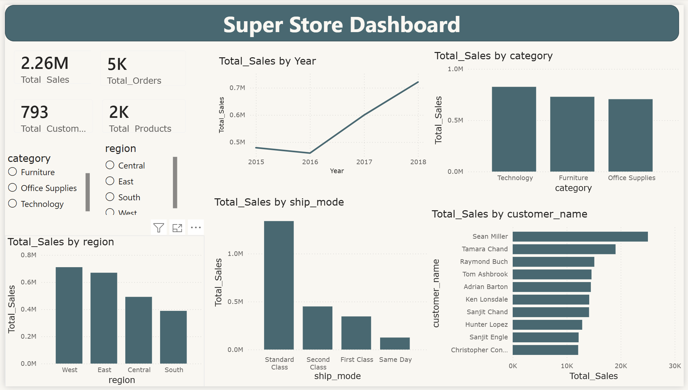

# Superstore-Sales-Analysis
# Superstore Sales Analysis — SQL & Power BI

## 📊 Project Overview

An end-to-end sales analysis project using **PostgreSQL and Power BI**.

I used SQL to analyze the Superstore dataset and Power BI to build an interactive dashboard to explore sales performance.

## 🛠️ Tools & Technologies

- PostgreSQL
- SQL
- Power BI
- DAX

## 📂 Dataset

[Superstore Sales Dataset](https://www.kaggle.com/datasets/rohitsahoo/sales-forecasting)

- **Rows:** 9,801
- **Columns:** 18

The dataset contains retail sales data including orders, customers, products, categories, regions, shipping modes, and sales.

## 📈 Dashboard

The dashboard includes:

- Total Sales
- Total Orders
- Total Customers
- Total Products
- Sales by Year
- Sales by Category
- Sales by Region
- Sales by Ship Mode
- Top 10 Customers by Sales
- Region and Category slicers

## 💡 Key Insights

- **Total Sales:** 2.26M
- **Technology** had the highest sales among categories.
- **West** was the highest-selling region.
- **Standard Class** had the highest sales among shipping modes.
- **2018** had the highest sales.
- **Sean Miller** was the top customer by sales.

## 🖼️ Dashboard Preview

